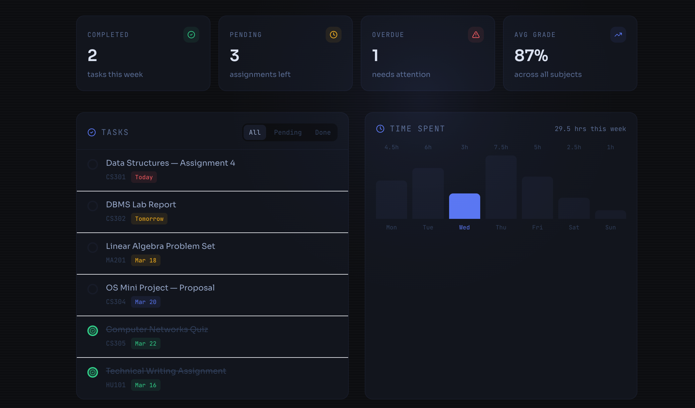
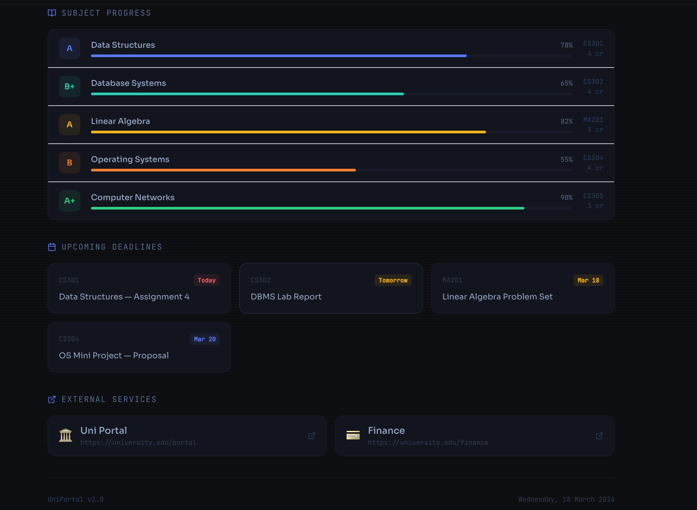

# StudyFlow 📚

StudyFlow is a React-based web application designed to help students manage their academic activities, track progress, and explore career opportunities efficiently through a clean and intuitive interface.

---

## 🚀 Features

- 📅 Timetable management
- 📝 Notes and assignments tracking
- 💼 Job opportunities dashboard
- 🎓 Career guidance modules
- 📊 Subject progress tracking
- 🎨 Clean and responsive UI using Tailwind CSS

---

## 📸 Screenshots

### 🏠 Dashboard Overview


### ⚡ Quick Access Panel


### 📊 Tasks & Time Tracking



### 📈 Subject Progress



---

## 🛠 Tech Stack

- React (Create React App)
- Tailwind CSS
- JavaScript (ES6+)

---

## 📦 Installation & Setup

Clone the repository and install dependencies:

```bash
git clone <repo-url>
cd StudyFlow
npm install
npm start
```

App will run at:
👉 http://localhost:3000

---

## 📁 Project Structure

```
StudyFlow/
│── public/        # Static assets
│── src/           # Main application logic
│── components/    # Reusable UI components
│── pages/         # Application pages (Dashboard, Jobs, etc.)
│── screenshots/   # Project screenshots for documentation
```

---

## ✨ Improvements Made

- Enhanced documentation for better project understanding
- Added screenshots for visual clarity
- Improved UI consistency and styling
- Refactored code for better readability

---

## 🔮 Future Enhancements

- User authentication system
- Real-time data integration
- Study planner with reminders
- Performance optimizations

---

## 📚 Learn More

- React Docs: https://reactjs.org/
- Create React App: https://create-react-app.dev/

---

## 👨‍💻 Contributors

- Jai Sachdeva
- Eshanya Padial
- Ishan Gautam
